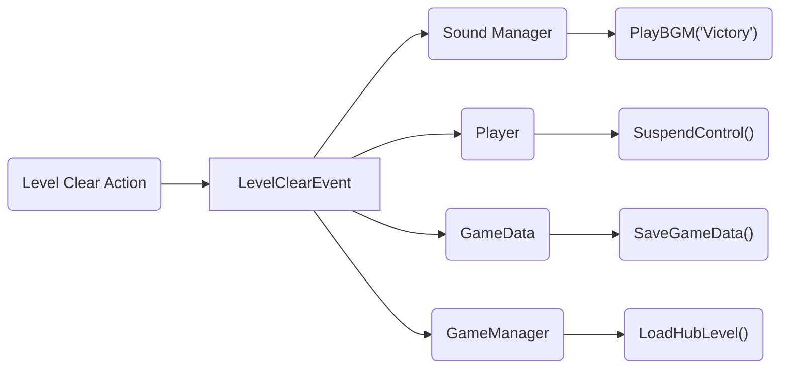

```mermaid
flowchart LR;
lc("Level Clear Action")
lc-->e["LevelClearEvent"]
e-->sm("Sound Manager")-->smeh("PlayBGM('Victory')")
e-->p("Player")-->peh("SuspendControl()")
e-->gd("GameData")-->gdeh("SaveGameData()")
e-->gm("GameManager")-->gmeh("LoadHubLevel()");
```
