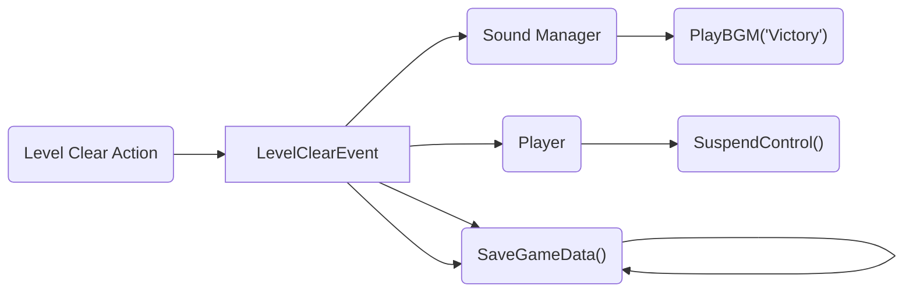

```mermaid
flowchart LR;
lc("Level Clear Action")
lc-->e["LevelClearEvent"]
e-->sm("Sound Manager")-->smeh("PlayBGM('Victory')")
e-->p("Player")-->peh("SuspendControl()")
e-->gm("GameData")-->gm("SaveGameData()")
e-->gm("GameManager")-->gm("SaveGameData()")
```
