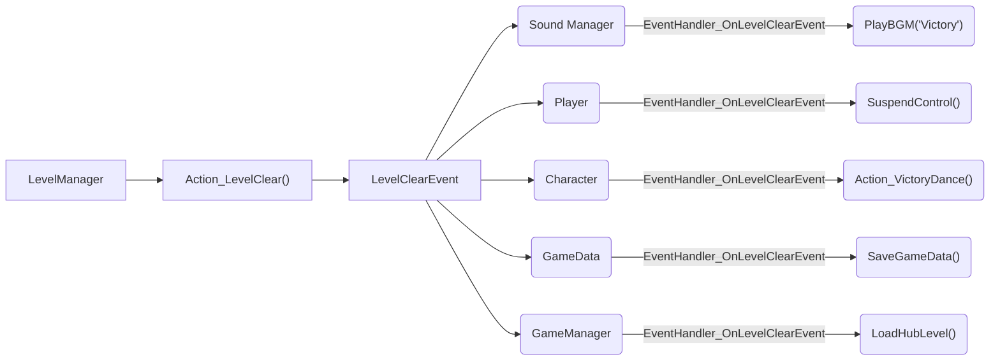
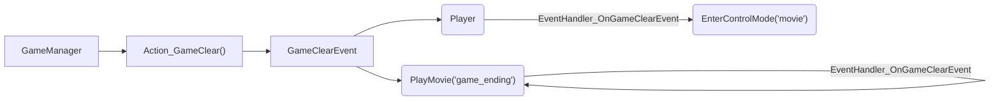

Level Complete

```mermaid
flowchart LR;
lm["LevelManager"]
lm-->lc["Action_LevelClear()"]
lc-->e["LevelClearEvent"]
e-->sm("Sound Manager")-->|EventHandler_OnLevelClearEvent|smeh("PlayBGM('Victory')")
e-->p("Player")-->|EventHandler_OnLevelClearEvent|peh("SuspendControl()")
e-->ch("Character")-->|EventHandler_OnLevelClearEvent|cheh("Action_VictoryDance()")
e-->gd("GameData")-->|EventHandler_OnLevelClearEvent|gdeh("SaveGameData()")
e-->gm("GameManager")-->|EventHandler_OnLevelClearEvent|gmeh("LoadHubLevel()");
```

Game Complete 

```mermaid
flowchart LR;
gm["GameManager"]
gm-->gc["Action_GameClear()"]
gc-->e["GameClearEvent"]
e-->mvm("MovieManager")-->|EventHandler_OnGameClearEvent|mvm("PlayMovie('game_ending')")
e-->p("Player")-->|EventHandler_OnGameClearEvent|peh("EnterControlMode('movie')")
```
