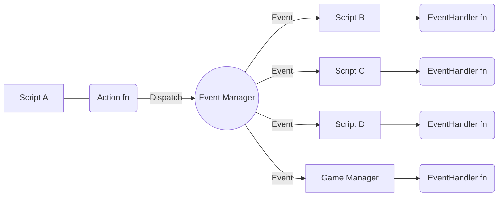

Unity

```cs
public class Character : MonoBehaviour {
    #region Variables
    // ...
    #endregion
    #region Hooks
    protected void OnEnable(){
        // ...
    }
    protected void OnDisable(){
        // ...
    }
    protected void Start(){
        // ...
    }
    protected void Update(){
        if (_isGrounded && Input.GetKeyDown(KeyCode.Space)){
            Action_Jump();
        }
        if (_canAttack && Input.GetKeyDown(KeyCode.JoystickButton1)){
            Action_AttackCombo();
        }
    }
    #endregion

    #region Get / Set
    public void GetAaa() { /* ... */ }
    public void GetBbb() { /* ... */ }
    private void SetAaa() { /* ... */ }
    private void SetBbb() { /* ... */ }
    #endregion

    #region Actions + Event Handlers
    // ----------------------------------------------
    // Jump
    // ----------------------------------------------
    // 1) Action
    private void Action_Jump(){
        EventManager.Dispatch(new CharacterEvents.OnJumpEvent() {
            Character = this,
            // ...
        })
    }
    // 2) Event Handler
    private void EventHandler_OnJumpEvent(CharacterEvents.OnJumpEvent evt) {
        if (evt.Character != this) return;
        // ...
    }
    // 3) Animation Event Handler (where applicable)
    private void AnimationEventHandler_OnJumpAnimationEvent(CharacterEvents.AnimationEvents.OnJumpAnimationEvent evt) {
        if (evt.Character != this) return;
        // ...
    }

    // ----------------------------------------------
    // Attack Combo
    // ----------------------------------------------
    // 1) Action
    private void Action_AttackCombo(){
        EventManager.Dispatch(new CharacterEvents.OnPlayerJumpEvent() {
            Character = this,
            // ...
        })
    }
    // 2) Event Handler
    private void EventHandler_OnAttackCombo(CharacterEvents.OnAttackComboEvent evt) {
        if (evt.Character != this) return;
        // ...
    }
    // 3) Animation Event Handler (where applicable)
    private void AnimationEventHandler_OnAttackComboAnimationEvent(CharacterEvents.AnimationEvents.OnAttackComboAnimationEvent evt) {
        if (evt.Character != this) return;
        // ...
    }
    #endregion

    #region Animation Event Action Handler
    // 4) AnimEventActionHandler = Dispatches an Event in response to an AnimationEvent,
    //    this is the sole public AnimationEvent callback function used on the timeline.
    public void AnimEventActionHandler(string animationEventData){
        var payload = AnimEventUtil.ExtractData(animationEventData);
        string animation = payload.animation;
        string context = payload.context;
        string data = payload.data;
        switch (animation) { 
            case "jump":
                EventManager.Dispatch(new CharacterEvents.AnimationEvents.OnJumpAnimationEvent(){
                    Character = this,
                    Context = context,
                    Data = data,
                });
            //...
        }
    }
    #endregion
}
```



```cs
// Util
using System;
using System.Collections.Generic;
using System.Collections;
public static class AnimEventUtil
{
    public static Dictionary<string, string> ExtractEventData(string animationData)
    {
        string[] parsed = animationData.Split(";");
        string animation = "";
        string context = "";
        string data = "";
        foreach (var i in parsed)
        {
            if (i.Contains("animation"))
            {
                animation = i.Replace("animation=", "");
            }
            if (i.Contains("context"))
            {
                animation = i.Replace("context=", "");
            }
            if (i.Contains("data"))
            {
                data = i.Replace("data=", "");
            }
        }
        return new Dictionary<string, string>() {
            { "animation", animation, }
            { "context", context, }
            { "data", data }
        };
    }
}


// Save Game
public struct OnSaveGameEvent : IEvent { }
void Action_SaveGameData()
{

}
void EventHandler_OnSaveGame(IOEvents.OnSaveGameEvent evt)
{

}

// Game Loading
public struct OnEnterLoadingStateEvent : IEvent { }
void Action_EnterLoadingState()
{

}
void EventHandler_OnEnterLoadingState(IOEvents.OnEnterLoadingStateEvent evt)
{

}

// Game Load
public struct OnLoadGameEvent : IEvent { }
void Action_LoadGameData()
{

}
void EventHandler_OnLoadGame(IOEvents.OnLoadGameEvent evt)
{

}

// Character Respawn
public struct OnCharacterRespawnEvent : IEvent { }
void Action_CharacterRespawn()
{

}
void EventHandler_OnCharacterRespawn(GameplayEvents.CharacterEvents.OnCharacterRespawn)
{

}

// Character Die
public struct OnCharacterDieEvent : IEvent { }
void Action_CharacterDie()
{

}
void EventHandler_OnCharacterDie(GameplayEvents.CharacterEvents.OnCharacterDie)
{

}

// Player Disable Control
public struct OnPlayerDisableControlEvent : IEvent { }
void Action_PlayerDisableControl()
{

}
void EventHandler_OnPlayerDisableControl(GameplayEvents.CharacterEvents.OnPlayerDisableControl)
{

}

// Player Disable Control
public struct OnPlayerEnableControlEvent : IEvent { }
void Action_PlayerEnableControl()
{

}
void EventHandler_OnPlayerEnableControl(GameplayEvents.CharacterEvents.OnPlayerEnableControl)
{

}

// Player Join
public struct OnPlayerJoinEvent : IEvent { }
void Action_PlayerJoin()
{

}
void EventHandler_OnPlayerJoin(GameplayEvents.CharacterEvents.OnPlayerJoin)
{

}

// Player Leave
public struct OnPlayerLeaveEvent : IEvent { }
void Action_PlayerLeave()
{

}
void EventHandler_OnPlayerLeave(GameplayEvents.CharacterEvents.OnPlayerLeaveEvent)
{

}

// Character Take Damage
public struct OnCharacterTakeDamageEvent : IEvent { }
void Action_CharacterTakeDamage()
{

}
void EventHandler_OnCharacterTakeDamage(GameplayEvents.CharacterEvents.OnCharacterTakeDamageEvent evt)
{

}

// Character Move Event
public struct OnCharacterMoveEvent : IEvent { }
void Action_CharacterMove()
{

}
void EventHandler_OnCharacterMove(GameplayEvents.CharacterEvents.OnCharacterMoveEvent evt)
{

}

// Character Interact
public struct OnCharacterInteractEvent : IEvent { }
void Action_CharacterInteract()
{

}
void EventHandler_OnCharacterInteract(GameplayEvents.CharacterEvents.OnCharacterInteractEvent evt)
{

}

// Character Attempt Take Down
public struct OnCharacterAttemptTakeDownEvent : IEvent { }
void Action_CharacterAttemptTakeDownEvent()
{

}
void EventHandler_OnCharacterAttemptTakeDownEventn(GameplayEvents.CharacterEvents.OnCharacterAttemptTakeDownEvent evt)
{

}

// Character Perform Take Down
public struct OnCharacterPerformTakeDownEvent : IEvent { }
void Action_CharacterPerformTakeDown()
{

}
void EventHandler_OnCharacterPerformTakeDown(GameplayEvents.CharacterEvents.OnCharacterPerformTakeDownEvent evt)
{

}

// Single animation event fn to handle all animation events
public struct CharacterPerformAerialTakeDownAnimationEvent : IEvent { }
void EventHandler_OnCharacterPerformAerialTakeDownAnimationEvent(GameplayEvents.PlayerEvents.CharacterPerformAerialTakeDownAnimationEvent evt)
{

}
public struct CharacterPerformAttackComboAnimationEvent : IEvent { }
public struct CharacterPerformAerialTakeDownAnimationEvent : IEvent { }
public struct CharacterPerformAttackComboAnimationEvent : IEvent { }
public struct CharacterPerformDashAnimationEvent : IEvent { }
public struct CharacterPerformDashAnimationEvent : IEvent { }
public struct CharacterPerformDieAnimationEvent : IEvent { }
public struct CharacterPerformGroundTakeDownAnimationEvent : IEvent { }
public struct CharacterPerformIdleAnimationEvent : IEvent { }
public struct CharacterPerformJumpAnimationEvent : IEvent { }
public struct CharacterPerformJumpAnimationEvent : IEvent { }
public struct CharacterPerformRespawnAnimationEvent : IEvent { }
public struct CharacterPerformRunAnimationEvent : IEvent { }
public struct CharacterPerformSlashAnimationEvent : IEvent { }
public struct CharacterPerformSlideAnimationEvent : IEvent { }
public struct CharacterPerformVictoryAnimationEvent : IEvent { }

public void CharacterAnimEventActionHandler(string animationEventDataCSV)
{
    string payload = AnimEventUtil.ExtractEventData(animationEventDataCSV);
    string animation = payload.animation;
    string context = payload.context; // start_up, active_frames, i_frames, recovery_frames, ;
    string data = payload.data; // 1, 2, etc..

    switch (animation)
    {
        case "aerial_take_down":
            EventManager.Dispatch(new GameplayEvents.CharacterEvents.OnCharacterPerformAerialTakeDownAnimationEvent
            {
                Animation = animation,
                Context = context,
                Data = data,
            })
        case "attack_combo":
            EventManager.Dispatch(new GameplayEvents.CharacterEvents.OnCharacterPerformAttackComboAnimationEvent
            {
                Character = this,
                Animation = animation,
                Context = context,
                Data = data,
            })
        case "dash":
            EventManager.Dispatch(new GameplayEvents.CharacterEvents.OnCharacterPerformDashAnimationEvent
            {
                Character = this,
                Animation = animation,
                Context = context,
                Data = data,
            })
        case "die":
            EventManager.Dispatch(new GameplayEvents.CharacterEvents.OnCharacterPerformDieAnimationEvent
            {
                Character = this,
                Animation = animation,
                Context = context,
                Data = data,
            })
        case "ground_take_down":
            EventManager.Dispatch(new GameplayEvents.CharacterEvents.OnCharacterPerformGroundTakeDownAnimationEvent
            {
                Character = this,
                Animation = animation,
                Context = context,
                Data = data,
            })
        case "idle":
            EventManager.Dispatch(new GameplayEvents.CharacterEvents.OnCharacterPerformIdleAnimationEvent
            {
                Character = this,
                Animation = animation,
                Context = context,
                Data = data,
            })
        case "jump":
            EventManager.Dispatch(new GameplayEvents.CharacterEvents.OnCharacterPerformJumpAnimationEvent
            {
                Character = this,
                Animation = animation,
                Context = context,
                Data = data,
            })
        case "run":
            EventManager.Dispatch(new GameplayEvents.CharacterEvents.OnCharacterPerformRunAnimationEvent
            {
                Character = this,
                Animation = animation,
                Context = context,
                Data = data,
            })
        case "respawn":
            EventManager.Dispatch(new GameplayEvents.CharacterEvents.OnCharacterPerformRespawnAnimationEvent
            {
                Character = this,
                Animation = animation,
                Context = context,
                Data = data,
            })
        case "slash":
            EventManager.Dispatch(new GameplayEvents.CharacterEvents.OnCharacterPerformSlashAnimationEvent
            {
                Character = this,
                Animation = animation,
                Context = context,
                Data = data,
            })
        case "slide":
            EventManager.Dispatch(new GameplayEvents.CharacterEvents.OnCharacterPerformSlideAnimationEvent
            {
                Character = this,
                Animation = animation,
                Context = context,
                Data = data,
            })
        case "take_damage":
            EventManager.Dispatch(new GameplayEvents.CharacterEvents.OnCharacterPerformTakeDamageAnimationEvent
            {
                Character = this,
                Animation = animation,
                Context = context,
                Data = data,
            })
        case "victory":
            EventManager.Dispatch(new GameplayEvents.CharacterEvents.OnCharacterPerformVictoryAnimationEvent
            {
                Character = this,
                Animation = animation,
                Context = context,
                Data = data,
            })
    }
}

// Bot Change Action State
public struct OnBotChangeActionStateEvent : IEvent { }
void Action_BotChangeActionState()
{

}
void EventHandler_OnBotChangeActionState(GameplayEvents.BotEvents.OnBotTakeDamageEvent evt)
{

}

// Bot Take Damage
public struct OnBotTakeDamageEvent : IEvent { }
void Action_BotTakeDamage()
{

}
void EventHandler_OnBotTakeDamage(GameplayEvents.BotEvents.OnBotTakeDamageEvent evt)
{

}

// Bot Die
public struct OnBotDieEvent : IEvent { }
void Action_BotDie()
{

}
void EventHandler_OnBotDie(GameplayEvents.BotEvents.OnBotDieEvent evt)
{

}

// Bot Detect Player
public struct OnBotDetectPlayerEvent : IEvent { }
void Action_BotDetectPlayer()
{

}
void EventHandler_OnBotDetectPlayer(GameplayEvents.BotEvents.OnBotDetectPlayerEvent evt)
{

}

// Bot Player Exit Detection
public struct OnBotPlayerExitDetectionEvent : IEvent { }
void Action_BotPlayerExitDetection()
{

}
void EventHandler_OnBotPlayerExitDetection(GameplayEvents.BotEvents.OnBotPlayerExitDetectionEvent evt)
{

}

// UI Navigate
public struct OnNavigateMenuEvent : IEvent { }
void Action_NavigateMenu()
{

}
void EventHandler_OnNavigateMenu(UIEvents.OnNavigateMenuEvent evt)
{

}

// UI Confirm
public struct OnConfirmSelectionEvent : IEvent { }
void Action_ConfirmSelection()
{

}
void EventHandler_OnConfirmSelection(UIEvents.OnConfirmSelectionEvent evt)
{

}

// UI Cancel
public struct OnCancelSelectionEvent : IEvent { }
void Action_CancelSelection()
{

}
void EventHandler_OnCancelSelection(UIEvents.OnCancelSelectionEvent evt)
{

}

// Pause
public struct OnTogglePauseEvent : IEvent { }
void Action_TogglePause()
{

}
void EventHandler_OnTogglePause(GameplayEvents.OnTogglePauseEvent evt)
{

}
```


```cs
public class Character : MonoBehaviour {
  /*
  * ---------------
  * Variables
  * ---------------
  *  Public variables are completely fine for first-pass.
  */
  public int Health;
  public bool IsStunned;

  /*
  * ---------------
  * Hooks
  * ---------------
  *  Hooks are part of the Unity LifeCycle.
  */
  void OnEnable(){
    EventManager.Subscribe<GameplayEvents.OnPlayerJumpEvent>(EventHandler_OnJumpEvent); // use this EventHandler to subscribe to this event when it's dispatched
    //...
  }
  void OnDisable(){
    EventManager.Unsubscribe<GameplayEvents.OnPlayerJumpEvent>(EventHandler_OnJumpEvent); // unsubscribe the EventHandler from this Event during cleanup
    //...
  }
  void Start(){
    //...
  }
  void Update(){
    //...
  }
  void OnTriggerEnter(Collider other){
    var enemyHurtBox = other.GetComponent<EnemyHurtBox>();
    if (!enemyHurtBox) return;

    var attackData = enemyHurtBox.GetAttack();
    Action_TakeDamage(attackData);
  }  

  /*
  * ---------------
  * Actions
  * ---------------
  *  Action fns dispatch events, this is how communication between scripts works.
  *  If the fn dispatches an event at any point, it is an Action_Fn.
  */
  void Action_TakeDamage(AttackData attack){
    EventManager.Dispatch(new GameplayEvents.OnTakeDamage {
      Character = this,
      Attack = attack,
    })
  }
  void Action_Jump(){
    if (_isGrounded && Input.GetKeyDown(KeyCode.Space)){
      EventManager.Dispatch(new GameplayEvents.OnPlayerJumpEvent{
        Character = this,
      })
    }
  }
  /*
  * ---------------
  * Event Handlers
  * ---------------
  * Event Handler fns are executed when the event they are subscribed to is dispatched
  */
  void EventHandler_OnTakeDamage(GameplayEvents.OnTakeDamage evt) {
    if (evt.Character != this) return; // ignore this event if it doesn't relate to this gameObject
    // ...
  }
  void EventHandler_OnJumpEvent(GameplayEvents.OnPlayerJumpEvent evt){
    if (evt.Character != this) return; // ignore this event if it doesn't relate to this gameObject
    // ... 
  }

}
```
