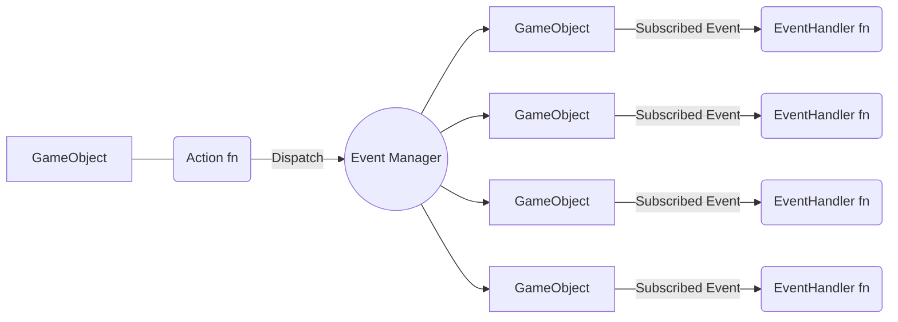

Unity



```cs
public class Character : MonoBehaviour {
  /*
  * ---------------
  * Variables
  * ---------------
  *  Public variables are completely fine for first-pass.
  */
  public int Health;
  public bool IsStunned;

  /*
  * ---------------
  * Hooks
  * ---------------
  *  Hooks are part of the Unity LifeCycle.
  */
  void OnEnable(){
    EventManager.Subscribe<GameplayEvents.OnPlayerJumpEvent>(EventHandler_OnJumpEvent); // use this EventHandler to subscribe to this event when it's dispatched
    //...
  }
  void OnDisable(){
    EventManager.Unsubscribe<GameplayEvents.OnPlayerJumpEvent>(EventHandler_OnJumpEvent); // unsubscribe the EventHandler from this Event during cleanup
    //...
  }
  void Start(){
    //...
  }
  void Update(){
    //...
  }
  void OnTriggerEnter(Collider other){
    var enemyHurtBox = other.GetComponent<EnemyHurtBox>();
    if (!enemyHurtBox) return;

    var attackData = enemyHurtBox.GetAttack();
    Action_TakeDamage(attackData);
  }  

  /*
  * ---------------
  * Actions
  * ---------------
  *  Action fns dispatch events, this is how communication between scripts works.
  */
  void Action_TakeDamage(AttackData attack){
    EventManager.Dispatch(new GameplayEvents.OnTakeDamage {
      Character = this,
      Attack = attack,
    })
  }
  void Action_Jump(){
    if (_isGrounded && Input.GetKeyDown(KeyCode.Space)){
      EventManager.Dispatch(new GameplayEvents.OnPlayerJumpEvent{
        Character = this,
      })
    }
  }
  /*
  * ---------------
  * Event Handlers
  * ---------------
  * Event Handler fns are executed when the event they are subscribed to is dispatched
  */
  void EventHandler_OnTakeDamage(GameplayEvents.OnTakeDamage evt) {
    if (evt.Character != this) return; // ignore this event if it doesn't relate to this gameObject
    // ...
  }
  void EventHandler_OnJumpEvent(GameplayEvents.OnPlayerJumpEvent evt){
    if (evt.Character != this) return; // ignore this event if it doesn't relate to this gameObject
    // ... 
  }

}
```
